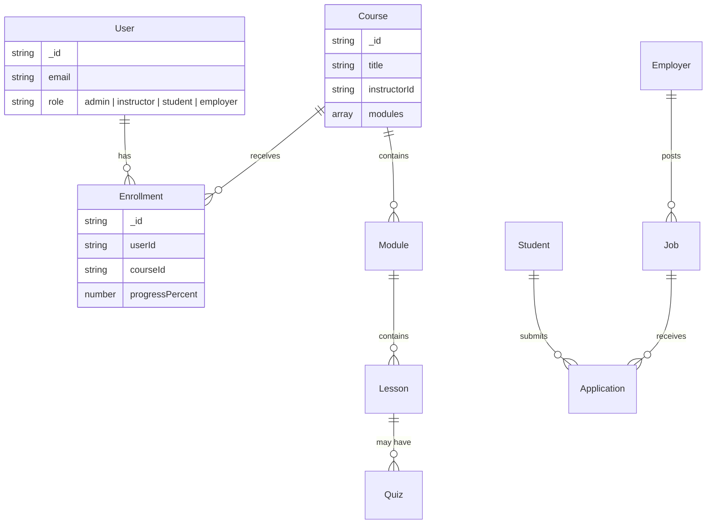

# Database Schema & Relationships (LMS Plugin)

The LMS ecosystem consists of 9 core collections, optimized for performance and relationship tracing in a MongoDB environment.

## 🗺️ Relationship Diagram (Mermaid)

## 📄 Model Definitions

### 1. Course Management
- **Course**: Title, Slug, Description, Price, Thumbnail, Category, Level, Instructor (Ref: User).
- **Lesson**: Title, Type (Video | Text | PDF), Content, Duration, IsPreview.
- **Quiz**: Title, PassingScore, TimeLimit, Questions (Array of Objects).

### 2. Opportunity Ecosystem
- **Job**: Title, CompanyId (Ref: Employer), SalaryRange, Location, Requirements.
- **Internship**: Duration, Stipend, Mode (Remote | In-office), Description.
- **Employer**: CompanyName, Logo, Industry, Website, VerifiedStatus.

### 3. Student Lifecycle & Intelligence
- **Student**: Bio, SkillTags, ResumeURL, EnrollmentHistory, CareerInterests (Array).
- **Application**: StudentId, OpportunityId, MatchScore (Number), Status.
- **Analytics**: UserAchievementRecords, LearningEngagementScore.

### 4. System Settings
- **LMS_Settings**: TaxRate, CertificateTemplates (Array), PaymentGatewayConfig.

## 🗝️ Cross-Plugin Integration
- **E-commerce Key**: Course IDs are linked to "Product" IDs in the main store.
- **User Key**: LMS `userId` is the same as the E-commerce `userId`, allowing for a single-sign-on (SSO) experience.
